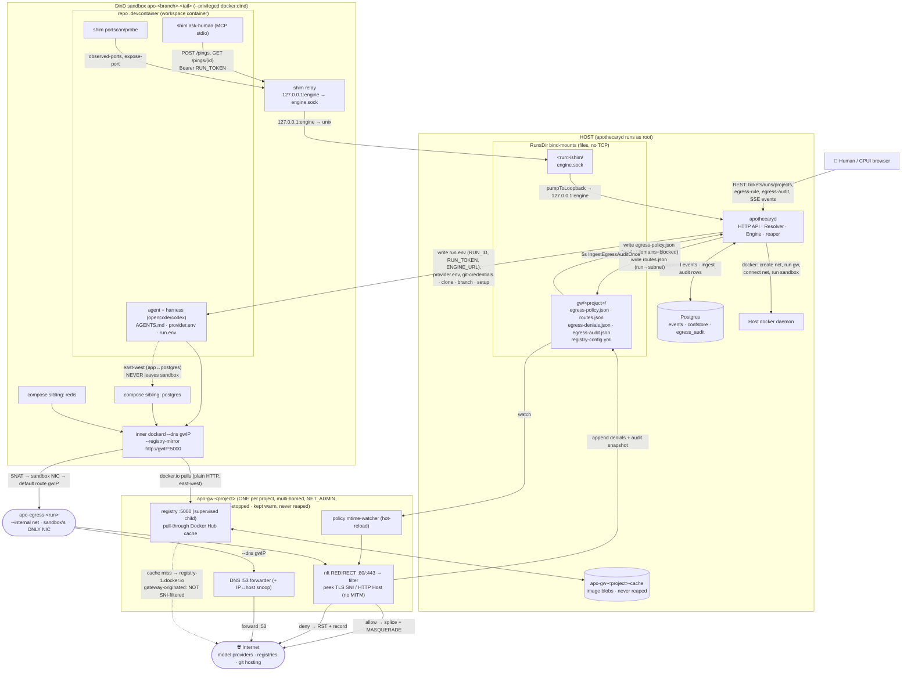
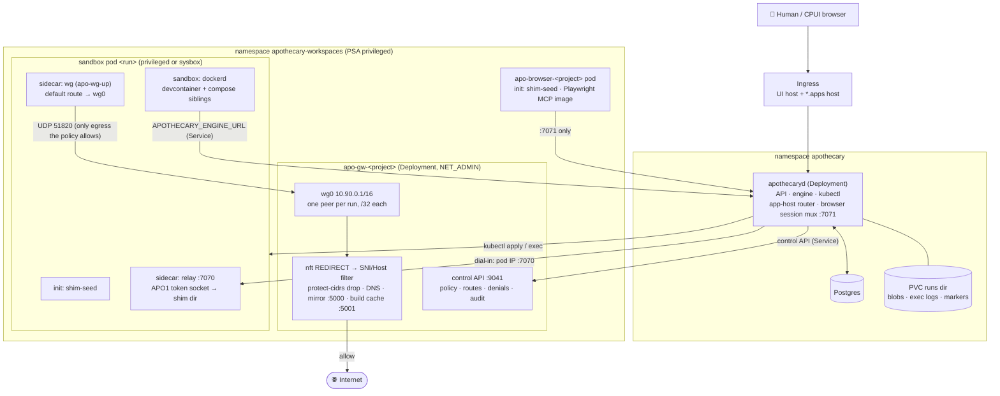

```mermaid
flowchart TB
    human["👤 Human / CPUI browser"]

    subgraph HOST["HOST (apothecaryd runs as root)"]
        direction TB
        apod["apothecaryd<br/>HTTP API · Resolver · Engine · reaper"]
        pg[("Postgres<br/>events · confstore · egress_audit")]
        dockerd["Host docker daemon"]
        subgraph MOUNTS["RunsDir bind-mounts (files, no TCP)"]
            gwdir["gw/&lt;project&gt;/<br/>egress-policy.json · routes.json<br/>egress-denials.json · egress-audit.json<br/>registry-config.yml"]
            shimdir["&lt;run&gt;/shim/<br/>engine.sock"]
        end
        cachevol[("apo-gw-&lt;project&gt;-cache<br/>image blobs · never reaped")]
    end

    subgraph GW["apo-gw-&lt;project&gt;  (ONE per project, multi-homed, NET_ADMIN,<br/>--restart unless-stopped · kept warm, never reaped)"]
        direction TB
        nft["nft REDIRECT :80/:443 → filter<br/>peek TLS SNI / HTTP Host (no MITM)"]
        dns["DNS :53 forwarder (+ IP↔host snoop)"]
        watch["policy mtime-watcher (hot-reload)"]
        mirror["registry :5000 (supervised child)<br/>pull-through Docker Hub cache"]
    end

    net(["apo-egress-&lt;run&gt;<br/>--internal net · sandbox's ONLY NIC"])

    subgraph SB["DinD sandbox  apo-&lt;branch&gt;-&lt;tail&gt;  (--privileged docker:dind)"]
        direction TB
        relay["shim relay<br/>127.0.0.1:engine → engine.sock"]
        innerd["inner dockerd --dns gwIP<br/>--registry-mirror http://gwIP:5000"]
        subgraph DC["repo .devcontainer (workspace container)"]
            agent["agent + harness (opencode/codex)<br/>AGENTS.md · provider.env · run.env"]
            askh["shim ask-human (MCP stdio)"]
            portscan["shim portscan/probe"]
        end
        pgc["compose sibling: postgres"]
        redis["compose sibling: redis"]
    end

    internet(["🌐 Internet<br/>model providers · registries · git hosting"])

    %% control plane
    human -->|"REST: tickets/runs/projects,<br/>egress-rule, egress-audit, SSE events"| apod
    apod <-->|"append events · ingest audit rows"| pg
    apod -->|"docker: create net, run gw,<br/>connect net, run sandbox"| dockerd

    %% policy + audit files
    apod -->|"write egress-policy.json (mode+domains+blocked)<br/>write routes.json (run→subnet)"| gwdir
    gwdir -->|watch| watch
    watch --> nft
    nft -->|"append denials + audit snapshot"| gwdir
    gwdir -->|"5s IngestEgressAuditOnce"| apod

    %% bootstrap into workspace
    apod -->|"write run.env (RUN_ID, RUN_TOKEN, ENGINE_URL),<br/>provider.env, git-credentials · clone · branch · setup"| agent

    %% engine bridge (unix, container→host-IP is blocked)
    askh -->|"POST /pings, GET /pings/{id}<br/>Bearer RUN_TOKEN"| relay
    portscan -->|"observed-ports, expose-port"| relay
    relay -->|"127.0.0.1:engine → unix"| shimdir
    shimdir -->|"pumpToLoopback → 127.0.0.1:engine"| apod

    %% egress path
    agent --> innerd
    pgc --> innerd
    redis --> innerd
    innerd -->|"SNAT → sandbox NIC → default route gwIP"| net
    net --> nft
    agent -.->|"east-west (app↔postgres)<br/>NEVER leaves sandbox"| pgc
    nft -->|"allow → splice + MASQUERADE"| internet
    nft -->|"deny → RST + record"| internet
    dns -->|"forward :53"| internet
    net -->|"--dns gwIP"| dns

    %% image mirror: warm cache shared by all of a project's runs
    innerd -->|"docker.io pulls (plain HTTP, east-west)"| mirror
    mirror <--> cachevol
    mirror -.->|"cache miss → registry-1.docker.io<br/>gateway-originated: NOT SNI-filtered"| internet

```
## On Kubernetes

The same gateway daemon; runs reach it over a WireGuard peer instead of a docker network, and the engine drives everything with kubectl.

```mermaid
flowchart TB
    human["👤 Human / CPUI browser"]
    ingress["Ingress<br/>UI host + *.apps host"]

    subgraph ENG["namespace apothecary"]
        apod["apothecaryd (Deployment)<br/>API · engine · kubectl<br/>app-host router · browser session mux :7071"]
        pg[("Postgres")]
        runs[("PVC runs dir<br/>blobs · exec logs · markers")]
    end

    subgraph WS["namespace apothecary-workspaces (PSA privileged)"]
        subgraph GW["apo-gw-&lt;project&gt; (Deployment, NET_ADMIN)"]
            wg0["wg0 10.90.0.1/16<br/>one peer per run, /32 each"]
            filt["nft REDIRECT → SNI/Host filter<br/>protect-cidrs drop · DNS · mirror :5000 · build cache :5001"]
            ctl["control API :9041<br/>policy · routes · denials · audit"]
        end
        subgraph SBX["sandbox pod &lt;run&gt; (privileged or sysbox)"]
            seed["init: shim-seed"]
            wgc["sidecar: wg (apo-wg-up)<br/>default route → wg0"]
            relay["sidecar: relay :7070<br/>APO1 token socket → shim dir"]
            dind["sandbox: dockerd<br/>devcontainer + compose siblings"]
        end
        br["apo-browser-&lt;project&gt; pod<br/>init: shim-seed · Playwright MCP image"]
    end

    internet(["🌐 Internet"])

    human --> ingress --> apod
    apod <--> pg
    apod --- runs
    apod -->|"kubectl apply / exec"| SBX
    apod -->|"control API (Service)"| ctl
    apod -->|"dial-in: pod IP :7070"| relay
    dind -->|"APOTHECARY_ENGINE_URL (Service)"| apod
    wgc -->|"UDP 51820 (only egress the policy allows)"| wg0
    wg0 --> filt -->|"allow"| internet
    br -->|":7071 only"| apod
```
