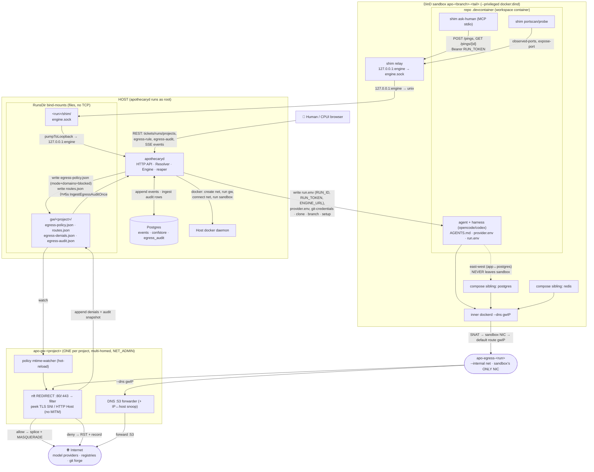

```mermaid
flowchart TB
    human["👤 Human / CPUI browser"]

    subgraph HOST["HOST (apothecaryd runs as root)"]
        direction TB
        apod["apothecaryd<br/>HTTP API · Resolver · Engine · reaper"]
        pg[("Postgres<br/>events · confstore · egress_audit")]
        dockerd["Host docker daemon"]
        subgraph MOUNTS["RunsDir bind-mounts (files, no TCP)"]
            gwdir["gw/&lt;project&gt;/<br/>egress-policy.json · routes.json<br/>egress-denials.json · egress-audit.json"]
            shimdir["&lt;run&gt;/shim/<br/>engine.sock"]
        end
    end

    subgraph GW["apo-gw-&lt;project&gt;  (ONE per project, multi-homed, NET_ADMIN)"]
        direction TB
        nft["nft REDIRECT :80/:443 → filter<br/>peek TLS SNI / HTTP Host (no MITM)"]
        dns["DNS :53 forwarder (+ IP↔host snoop)"]
        watch["policy mtime-watcher (hot-reload)"]
    end

    net(["apo-egress-&lt;run&gt;<br/>--internal net · sandbox's ONLY NIC"])

    subgraph SB["DinD sandbox  apo-&lt;branch&gt;-&lt;tail&gt;  (--privileged docker:dind)"]
        direction TB
        relay["shim relay<br/>127.0.0.1:engine → engine.sock"]
        innerd["inner dockerd --dns gwIP"]
        subgraph DC["repo .devcontainer (workspace container)"]
            agent["agent + harness (opencode/codex)<br/>AGENTS.md · provider.env · run.env"]
            askh["shim ask-human (MCP stdio)"]
            portscan["shim portscan/probe"]
        end
        pgc["compose sibling: postgres"]
        redis["compose sibling: redis"]
    end

    internet(["🌐 Internet<br/>model providers · registries · git forge"])

    %% control plane
    human -->|"REST: tickets/runs/projects,<br/>egress-rule, egress-audit, SSE events"| apod
    apod <-->|"append events · ingest audit rows"| pg
    apod -->|"docker: create net, run gw,<br/>connect net, run sandbox"| dockerd

    %% policy + audit files
    apod -->|"write egress-policy.json (mode+domains+blocked)<br/>write routes.json (run→subnet)"| gwdir
    gwdir -->|watch| watch
    watch --> nft
    nft -->|"append denials + audit snapshot"| gwdir
    gwdir -->|"5s IngestEgressAuditOnce"| apod

    %% bootstrap into workspace
    apod -->|"write run.env (RUN_ID, RUN_TOKEN, ENGINE_URL),<br/>provider.env, git-credentials · clone · branch · setup"| agent

    %% engine bridge (unix, container→host-IP is blocked)
    askh -->|"POST /pings, GET /pings/{id}<br/>Bearer RUN_TOKEN"| relay
    portscan -->|"observed-ports, expose-port"| relay
    relay -->|"127.0.0.1:engine → unix"| shimdir
    shimdir -->|"pumpToLoopback → 127.0.0.1:engine"| apod

    %% egress path
    agent --> innerd
    pgc --> innerd
    redis --> innerd
    innerd -->|"SNAT → sandbox NIC → default route gwIP"| net
    net --> nft
    agent -.->|"east-west (app↔postgres)<br/>NEVER leaves sandbox"| pgc
    nft -->|"allow → splice + MASQUERADE"| internet
    nft -->|"deny → RST + record"| internet
    dns -->|"forward :53"| internet
    net -->|"--dns gwIP"| dns

```